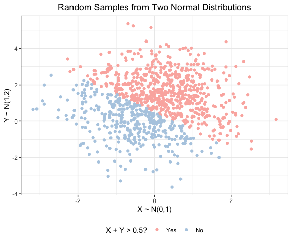

PUBH 7462 Homework 1
================
Chris Wojan
2/1/2022

### Problem 2.1

#### Independent Bivariate Normal Random Sample

``` r
## Create a tibble including random samples from two normal distributions
## and an indicator for the sum of each row
sample_data <- tibble(x = rnorm(n = 1000, mean = 0, sd = 1),
                      y = rnorm(n = 1000, mean = 1, sd = sqrt(2)),
                      sum_indicator = ifelse(x + y > 0.5, "Yes", "No"))

## Factorize the indicator variable
sample_data <- mutate(sample_data, 
                      sum_indicator = factor(sum_indicator, levels = c("Yes","No")))

## Plot the sample data
ggplot(data = sample_data) + 
  geom_point(aes(x = x, y = y, color = sum_indicator)) +
  scale_color_brewer(palette = "Pastel1",
                     guide = guide_legend(title = "X + Y > 0.5?")) + 
  labs(title = "Random Samples from Two Normal Distributions",
       x = "X ~ N(0,1)",
       y = "Y ~ N(1,2)")
```



### Problem 2.2

#### Penguin EDA

``` r
## Read data with relative path
penguin.df <- read_rds("./data/penguin.RDS")
```

##### Data Description

In the “penguin.df” data, each row represents an observation of an
individual penguin. The data set includes 344 penguin observations and 8
recorded variables for each.

| Column            | Description                                |
|-------------------|--------------------------------------------|
| species           | Species of penguin                         |
| island            | Island location of penguin                 |
| bill_length_mm    | Length of penguin’s bill in millimeters    |
| bill_depth_mm     | Depth of penguin’s bill in millimeters     |
| flipper_length_mm | Length of penguin’s flipper in millimeters |
| body_mass_g       | Mass of penguin in grams                   |
| sex               | Sex of penguin                             |
| year              | Year of observation                        |

The mean flipper length is 200.9152 with a standard deviation of
14.0617.  
The mean bill length is 43.9219 with a standard deviation of 5.4596.

##### Data Visualization

``` r
## Relabel the sex factor for better plot aesthetics
penguin.df <- mutate(penguin.df,
                     sex = fct_explicit_na(sex, na_level = "Unrecorded"),
                     sex = fct_recode(sex, Female = "female", Male = "male"))

## Save plot of flipper length by bill length by species
flip_bill_plot <-
  ggplot(data = penguin.df) + 
  geom_point(aes(x = bill_length_mm, y = flipper_length_mm, color = species)) + 
  scale_color_brewer(palette = "Pastel1",
                     guide = guide_legend(title = "Species")) + 
  labs(title = "Relationship of Penguin Flipper Length and Bill Length, by Species",
       x = "Length of Bill (mm)",
       y = "Length of Flipper (mm)")

## Draw above plot
flip_bill_plot
```


``` r
## Draw a new plot now facetting by sex
flip_bill_plot +
  facet_wrap(vars(sex)) +
  labs(title = "Relationship of Penguin Flipper Length and Bill Length, by Species and Sex")
```


**Trends**  
Bill length and flipper length appear to be positively correlated.
Gentoo penguins tend to have longer flippers than Adelie and chinstrap
penguins. Chinstrap penguins tend to have longer bills than Adelie
penguins. Males seem to have longer bills and flippers than females.
